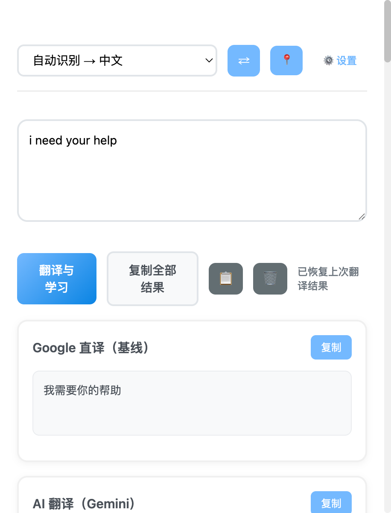
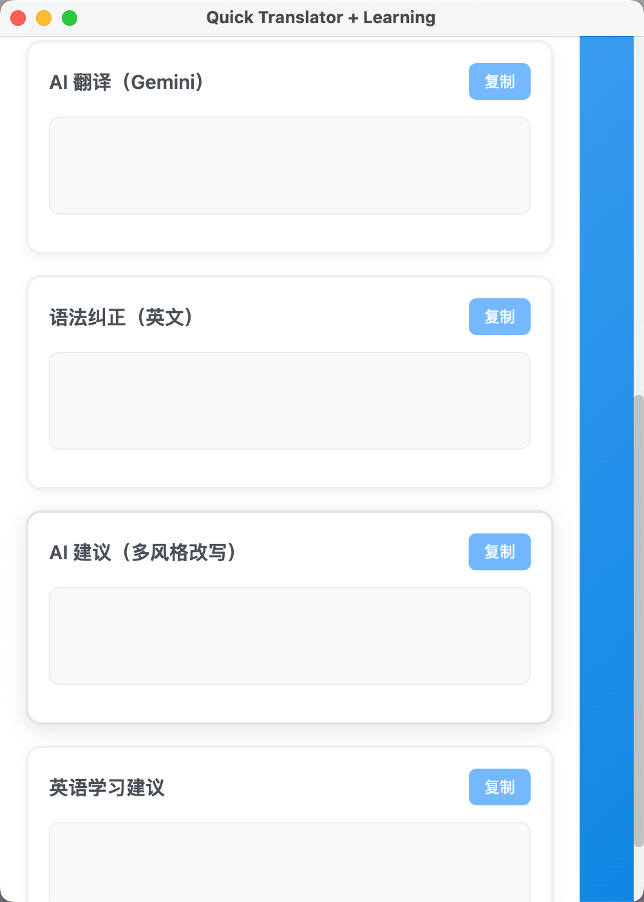
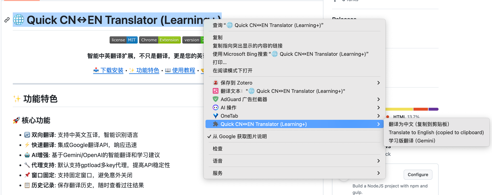
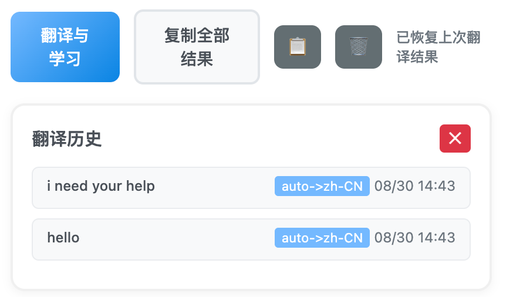
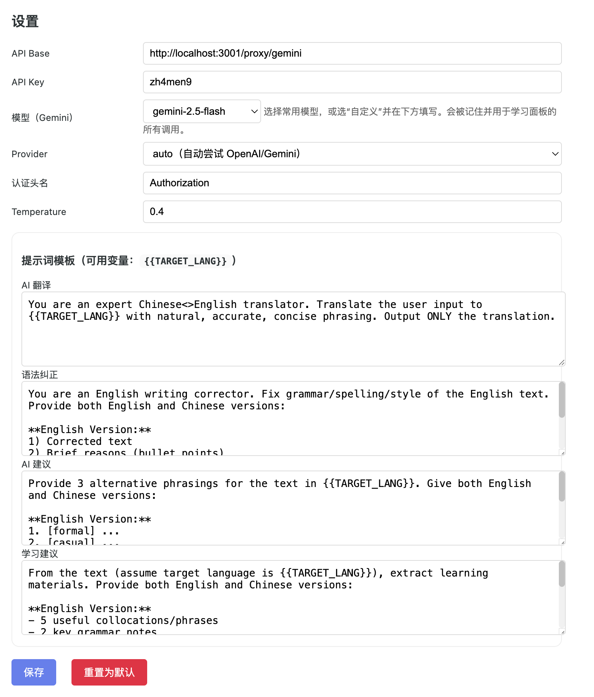

# 🌐 Quick CN↔EN Translator (Learning+)

<div align="center">


**智能中英翻译扩展，不只是翻译，更是您的英语学习助手！**

[📥 下载安装](#安装使用) • [✨ 功能特色](#功能特色) • [📖 使用教程](#使用教程) • [🤝 贡献指南](#贡献指南)

</div>

---

## ✨ 功能特色

### 🚀 核心功能
- **🔄 双向翻译**: 支持中英文互译，智能识别语言
- **⚡ 快速翻译**: 集成Google翻译API，响应迅速
- **🤖 AI增强**: 基于Gemini/OpenAI的智能翻译和学习建议
- **🔧 代理支持**: 默认支持gptload多key代理，提高API稳定性
- **📌 窗口固定**: 支持固定窗口，避免意外关闭
- **📋 历史记录**: 保存翻译历史，随时查看过往结果

### 🎯 AI学习功能
- **📝 语法纠正**: AI检查并纠正英文语法错误
- **🎨 风格建议**: 提供正式、随意、简洁三种表达方式
- **🎓 学习建议**: 提取有用短语、语法要点和练习题
- **🌏 中英对照**: 所有AI功能同时提供中英文解释

### 🎨 用户体验
- **🎨 现代化UI**: 清新的蓝色渐变设计，界面美观
- **⚡ 流式显示**: Google翻译先显示，AI结果随后更新
- **📱 响应式**: 适配不同屏幕尺寸
- **🎯 右键快捷**: 网页选中文字右键即可翻译

---

## 🛠 安装使用

### 方式一：开发者模式安装（推荐）

1. **下载源码**
   ```bash
   git clone https://github.com/zh4men9/quick-translator.git
   cd quick-translator
   ```

2. **加载扩展**
   - 打开Chrome浏览器，访问 `chrome://extensions/`
   - 开启右上角"开发者模式"
   - 点击"加载已解压的扩展程序"
   - 选择下载的项目文件夹

3. **开始使用**
   - 工具栏会出现扩展图标
   - 点击图标打开翻译面板
   - 或在网页中选中文字右键翻译

### 方式二：Chrome商店安装（即将上线）
> 🚀 即将在Chrome Web Store上线，敬请期待！

---

## 📖 使用教程

### 🎯 基础翻译
<div align="center">

</div>

1. **打开扩展**: 点击工具栏图标或使用快捷键
2. **选择方向**: 选择翻译方向（自动识别 → 中文/English）
3. **输入文本**: 在文本框中输入要翻译的内容
4. **开始翻译**: 点击"翻译与学习"或按 `Ctrl+Enter`
5. **查看结果**: 查看Google直译和AI增强结果

### 🤖 AI学习功能
<div align="center">

</div>

#### 语法纠正
- **功能**: 自动检测并纠正英文语法、拼写错误
- **特色**: 提供中英文对照的修改说明和原因

#### 风格建议  
- **功能**: 提供同一内容的不同表达方式
- **类型**: 正式、随意、简洁三种风格
- **用途**: 帮助选择最适合语境的表达

#### 学习建议
- **短语提取**: 从文本中提取5个有用的搭配或短语
- **语法要点**: 总结2个关键语法知识点  
- **练习题**: 生成2个相关练习题，答案在末尾

### ⚡ 快捷操作
#### 右键翻译
<div align="center">

</div>

1. **选中文字**: 在任意网页选中要翻译的文字
2. **右键菜单**: 出现三个翻译选项
   - 翻译为中文（复制到剪贴板）
   - Translate to English (copied to clipboard)  
   - 学习版翻译（Gemini）- 显示浮层面板

#### 键盘快捷键
- `Ctrl+Enter` (Windows) / `⌘+Enter` (Mac): 快速翻译
- `⇄` 按钮: 交换翻译方向
- `📍` 按钮: 固定/取消固定窗口

### 📋 历史记录
<div align="center">

</div>

1. **查看历史**: 点击 `📋` 按钮打开历史面板
2. **选择记录**: 点击任一历史记录重新加载
3. **清除历史**: 点击 `🗑` 按钮清除所有记录

### ⚙️ 高级设置
<div align="center">

</div>

#### API配置方案

**方案一：使用gptload代理（推荐）**
1. 部署 [gptload](https://github.com/AprilNEA/GPTLoad) 项目
2. 配置多个Gemini API key提高稳定性
3. 扩展设置中使用：
   - API地址：`http://localhost:3001/proxy/gemini`
   - API密钥：gptload中配置的密钥
   - 模型：gemini-2.5-flash（推荐）

**方案二：直接使用官方API**
- **API地址**: 直接使用Gemini或OpenAI官方API端点
- **API密钥**: 设置您的官方API密钥  
- **模型选择**: 选择对应的模型版本
- **提供商**: auto/openai/gemini三种选择

#### 自定义提示词
- **AI翻译**: 自定义AI翻译的提示词
- **语法纠正**: 自定义语法纠正的规则
- **风格建议**: 自定义建议生成的方式  
- **学习建议**: 自定义学习内容的提取规则

---

## 🔧 开发指南

### 技术栈
- **前端**: 原生JavaScript + HTML5 + CSS3
- **架构**: Chrome Extension Manifest V3
- **AI集成**: Gemini API / OpenAI API
- **翻译API**: Google Translate API

### 项目结构
```
quick-translator/
├── manifest.json          # 扩展配置文件
├── popup.html             # 主界面HTML
├── popup.js               # 主界面逻辑
├── background.js          # 后台服务脚本  
├── options.html           # 设置页面HTML
├── options.js             # 设置页面逻辑
├── styles.css             # 样式文件
└── README.md              # 项目文档
```

### 本地开发
```bash
# 克隆项目
git clone https://github.com/zh4men9/quick-translator.git

# 在Chrome中加载扩展
# 1. 打开 chrome://extensions/  
# 2. 开启开发者模式
# 3. 点击"加载已解压的扩展程序"
# 4. 选择项目文件夹

# 开发调试
# - 修改代码后点击扩展页面的刷新按钮
# - 右键popup界面选择"检查"查看开发者工具
# - 在 chrome://extensions/ 中点击"service worker"查看后台日志
```

---

## 🤝 贡献指南

我们欢迎各种形式的贡献！

### 📝 提交Issue
- 🐛 **Bug报告**: 发现问题请详细描述复现步骤
- 💡 **功能建议**: 有好想法欢迎分享
- 📖 **文档改进**: 发现文档不清楚的地方

### 🔧 代码贡献
1. Fork 此项目
2. 创建特性分支: `git checkout -b feature/amazing-feature`
3. 提交更改: `git commit -m 'Add amazing feature'`
4. 推送分支: `git push origin feature/amazing-feature`  
5. 提交Pull Request

### 📋 开发规范
- 代码风格：遵循现有代码风格
- 提交信息：使用清晰的提交信息
- 测试：确保功能正常工作
- 文档：更新相关文档

---

## ❓ 常见问题

### Q: 如何配置AI功能？
A: 点击设置按钮，配置API地址和密钥。默认使用 `localhost:3001` 代理服务（推荐使用[gpt-load](https://www.gpt-load.com/)项目转发多个Gemini key，提高稳定性和避免限制）。

### Q: 翻译失败怎么办？
A: 
1. 检查网络连接
2. 确认API配置正确
3. 查看浏览器控制台错误信息

### Q: 支持哪些浏览器？
A: 主要支持Chrome，也兼容基于Chromium的浏览器（如Edge、Brave等）。

### Q: 数据安全吗？  
A: 翻译数据通过HTTPS传输，历史记录仅保存在本地，不会上传到服务器。

---

## 📄 许可证

本项目采用 [MIT License](LICENSE) 开源协议。

---

## 🙏 致谢

- **Google Translate API** - 提供基础翻译服务
- **Gemini API** - 提供AI增强功能  
- **Chrome Extension** - 提供扩展平台
- **开源社区** - 提供灵感和支持

---

## 📞 联系我们

- 📧 **Email**: zh4men9@163.com
- 🐙 **GitHub**: [@zh4men9](https://github.com/zh4men9)
- 💬 **Issues**: [项目Issues页面](https://github.com/zh4men9/quick-translator/issues)

---

<div align="center">

**如果这个项目对您有帮助，请给我们一个 ⭐ Star！**

[⬆ 回到顶部](#-quick-cnen-translator-learning)

</div>